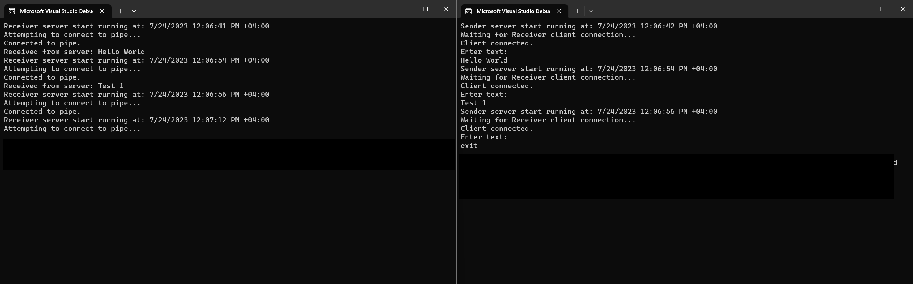

# Inter Process Communication sample using .Net Named Pipes 
InterProcess Communication (IPC) Sample App using Named Pipes in .NET

This repository contains a simple sample application demonstrating InterProcess Communication (IPC) using named pipes in .NET. Named pipes are a powerful communication mechanism for establishing communication between different processes on the same machine. The "Sender" and "Receiver" applications establish a communication channel using named pipes, allowing real-time message exchange between them on the same machine.

- **Sender Console App**: The "Sender" application acts as a server that creates a named pipe and waits for incoming client messages.

- **Receiver Console App**: The "Receiver" application functions as a client that connects to the named pipe created by the Sender, enabling the exchange of messages.

Here is an example of how it works
